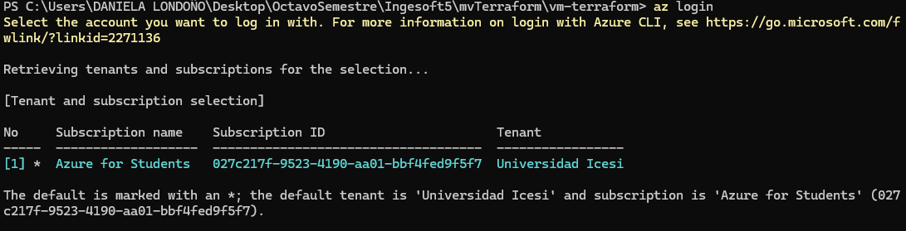
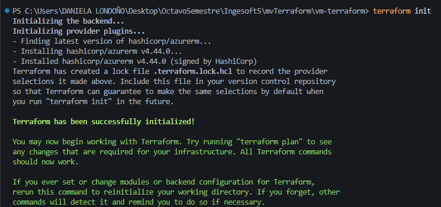
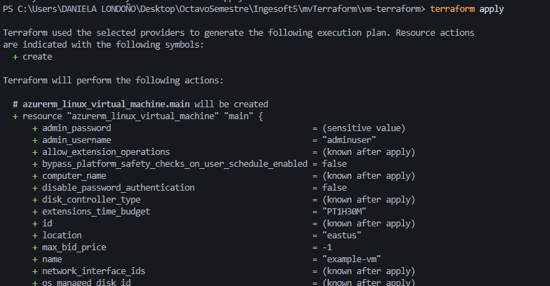
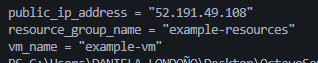
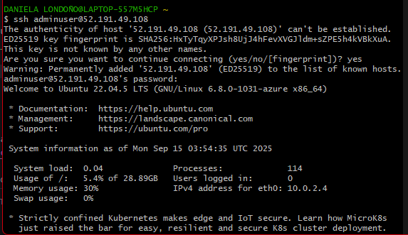

# Creación de una Máquina Virtual en Azure con Terraform

Este documento describe paso a paso el proceso para desplegar una **máquina virtual Linux en Azure** utilizando **Terraform**.

---

## 1. Iniciar sesión en Azure

Autenticación en la cuenta de Azure:

```bash
az login
```

Esto abrirá el navegador para autenticación.
Verifica la suscripción activa:

```bash
az account show --output table
```



---

## 2. Archivos de Terraform

El proyecto incluye los siguientes archivos principales:

### `main.tf`

Contiene el **provider** y la definición de la red, recursos y VM.

```hcl
provider "azurerm" {
  features {}
  subscription_id = "XXXXXXXX-XXXX-XXXX-XXXX-XXXXXXXXXXXX"
}

resource "azurerm_resource_group" "main" {
  name     = "${var.prefix}-resources"
  location = var.location
}

# ...
```

### `variables.tf`

Define las variables personalizables:

```hcl
variable "prefix" {
  default     = "example"
}

variable "location" {
  default     = "eastus"
}

variable "admin_username" {
  default     = "adminuser"
}

variable "admin_password" {
  default     = ""
}
```

### `outputs.tf`

Muestra información clave al finalizar la ejecución:

```hcl
output "vm_name" {
  value = azurerm_linux_virtual_machine.main.name
}

output "resource_group_name" {
  value = azurerm_resource_group.main.name
}

output "public_ip_address" {
  value = azurerm_public_ip.main.ip_address
}
```

---

## 3. Inicializar Terraform

Ejecutamos en la carpeta del proyecto:

```bash
terraform init
```



---

## 4. Plan de ejecución

Verificamos qué recursos se van a crear:

```bash
terraform plan
```


---

## 5. Aplicar los cambios

Creamos los recursos en Azure:

```bash
terraform apply
```



---

Al finalizar vemos:

```
Outputs:

public_ip_address = "52.xxx.xxx.xxx"
resource_group_name = "example-resources"
vm_name = "example-vm"
```



---

## 6. Conexión a la máquina virtual

Con el comando:

```bash
ssh adminuser@52.xxx.xxx.xxx
```

Introducimos la contraseña definida en `admin_password`.



